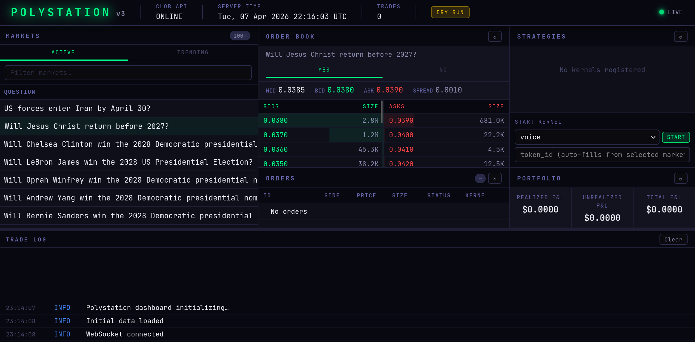

```
██████╗  ██████╗ ██╗  ██╗   ██╗███████╗████████╗ █████╗ ████████╗██╗ ██████╗ ███╗   ██╗
██╔══██╗██╔═══██╗██║  ╚██╗ ██╔╝██╔════╝╚══██╔══╝██╔══██╗╚══██╔══╝██║██╔═══██╗████╗  ██║
██████╔╝██║   ██║██║   ╚████╔╝ ███████╗   ██║   ███████║   ██║   ██║██║   ██║██╔██╗ ██║
██╔═══╝ ██║   ██║██║    ╚██╔╝  ╚════██║   ██║   ██╔══██║   ██║   ██║██║   ██║██║╚██╗██║
██║     ╚██████╔╝███████╗██║   ███████║   ██║   ██║  ██║   ██║   ██║╚██████╔╝██║ ╚████║
╚═╝      ╚═════╝ ╚══════╝╚═╝   ╚══════╝   ╚═╝   ╚═╝  ╚═╝   ╚═╝   ╚═╝ ╚═════╝ ╚═╝  ╚═══╝
```

**Full Polymarket trading station.** Pluggable strategy kernels, live web dashboard, real-time market data, order execution, and portfolio tracking.



---

## Architecture

```
polystation/
├── core/                        # Engine & framework
│   ├── engine.py                # TradingEngine — kernel lifecycle, component wiring
│   ├── kernel.py                # Kernel ABC — base class for all strategies
│   ├── portfolio.py             # Position tracking, realized/unrealized P&L
│   ├── orders.py                # Order lifecycle (7 states), fill tracking
│   └── events.py                # Async event bus for inter-component comms
│
├── market/                      # Market data layer
│   ├── client.py                # MarketDataClient — CLOB REST API wrapper
│   ├── book.py                  # OrderBook model with best bid/ask/spread
│   ├── scanner.py               # Market discovery via Gamma API
│   └── feed.py                  # WebSocket feed with auto-reconnect
│
├── trading/                     # Execution layer
│   ├── client.py                # CLOB client factory (Polygon)
│   ├── orders.py                # Order submission with exponential backoff
│   ├── execution.py             # ExecutionEngine — order routing, dry-run mode
│   └── recorder.py              # JSON persistence for trades & detections
│
├── kernels/                     # Pluggable trading strategies
│   ├── voice/                   # Speech recognition → trade on keywords
│   │   └── kernel.py            # YouTube, Twitter/X, radio audio streams
│   ├── market_maker/            # Spread-based market making
│   │   └── kernel.py            # Symmetric bid/ask around midpoint
│   └── signal/                  # Price momentum / mean-reversion
│       └── kernel.py            # Rolling window signal generation
│
├── dashboard/                   # Live web dashboard
│   ├── app.py                   # FastAPI application (22 endpoints + WS)
│   ├── ws.py                    # WebSocket hub for real-time updates
│   ├── api/                     # REST routes (markets, orders, strategies, portfolio)
│   └── static/                  # Dark terminal UI (HTML/JS/CSS)
│
├── wallet/                      # Blockchain wallet management
│   ├── generator.py             # BIP44 wallet generation
│   ├── allowances.py            # Polygon contract approvals
│   └── credentials.py           # CLOB API key management
│
├── speech/                      # Speech recognition engine
│   ├── recognizer.py            # Vosk offline recognition
│   └── detector.py              # Keyword matching with trigger types
│
└── sources/                     # Audio stream sources
    ├── youtube.py               # yt-dlp + ffmpeg
    ├── twitter.py               # Twitter/X Spaces via yt-dlp
    └── radio.py                 # HTTP radio streams
```

## Requirements

- Python 3.10+
- FFmpeg (for voice kernel audio processing)
- Polygon wallet with MATIC and USDC (for live trading)

## Installation

```bash
git clone https://github.com/itisaevalex/assisted_speech_bot.git
cd assisted_speech_bot
pip install -e ".[dev]"
```

## Quick Start

### Launch the Dashboard

```bash
# Start the trading station (dry-run mode by default)
uvicorn polystation.dashboard.app:create_app --factory --port 8420

# Open http://localhost:8420 in your browser
```

### CLI Usage

```bash
# Monitor audio streams (voice kernel standalone)
polystation monitor youtube --url "https://youtube.com/watch?v=..." --debug
polystation monitor twitter --url "https://x.com/i/broadcasts/..."
polystation monitor radio --url "https://streams.example.com/stream.mp3"

# Wallet setup
polystation setup wallet
polystation setup allowances
polystation setup api-keys
```

## Trading Kernels

Kernels are pluggable trading strategies that run inside the TradingEngine.

### Voice Kernel

Monitors live audio streams for keywords and triggers trades when detected.

```yaml
# config/strategies/voice.yaml
source_type: youtube
url: "https://youtube.com/watch?v=..."
keywords:
  crypto_market:
    keywords: ["crypto", "bitcoin"]
    side: BUY
    price: 0.9
    size: 100
```

### Market Maker Kernel

Places symmetric bid/ask orders around the midpoint with configurable spread.

| Parameter | Default | Description |
|-----------|---------|-------------|
| `token_id` | required | Token to market-make |
| `spread` | 0.02 | Half-spread from midpoint |
| `size` | 50 | Order size per side |
| `refresh_interval` | 30s | Seconds between quote refreshes |
| `max_position` | 500 | Max net position before pausing buys |

### Signal Kernel

Generates BUY/SELL signals based on price momentum or mean-reversion.

| Parameter | Default | Description |
|-----------|---------|-------------|
| `token_id` | required | Token to trade |
| `strategy` | momentum | `momentum` or `mean_reversion` |
| `lookback` | 10 | Price samples for signal calculation |
| `threshold` | 0.02 | Min fractional change to trigger |
| `poll_interval` | 30s | Seconds between price checks |

### Writing Custom Kernels

```python
from polystation.core.kernel import Kernel
from polystation.kernels import register

@register
class MyKernel(Kernel):
    name = "my-strategy"

    async def start(self) -> None:
        # Access via self.engine:
        #   self.engine.market_data  — prices, order books
        #   self.engine.orders       — create/track orders
        #   self.engine.execution    — submit orders to CLOB
        #   self.engine.portfolio    — positions and P&L
        #   self.engine.events       — pub/sub event bus
        ...

    async def stop(self) -> None:
        ...
```

## Dashboard

The web dashboard at `http://localhost:8420` provides:

| Panel | Description |
|-------|-------------|
| Markets | Active Polymarket markets with bid/ask, volume |
| Order Book | Live bids/asks for selected market |
| Strategies | Running kernels with status and controls |
| Orders | Recent order history with fill status |
| Portfolio | Positions, P&L breakdown |
| Trade Log | Scrolling execution log |

### API Endpoints

| Method | Path | Description |
|--------|------|-------------|
| GET | `/api/markets/` | Active markets from Gamma API |
| GET | `/api/markets/trending` | Highest volume markets |
| GET | `/api/markets/book/{token_id}` | Order book snapshot |
| GET | `/api/markets/price/{token_id}` | Pricing data |
| GET | `/api/orders/` | Recent orders |
| GET | `/api/orders/active` | Active orders |
| GET | `/api/strategies/` | Engine + kernel status |
| GET | `/api/strategies/available` | Registered kernel types |
| POST | `/api/strategies/start` | Deploy a kernel |
| POST | `/api/strategies/stop/{name}` | Stop a kernel |
| GET | `/api/portfolio/` | Portfolio summary |
| GET | `/api/portfolio/pnl` | P&L breakdown |
| WS | `/ws` | Real-time updates |

## Configuration

### Environment Variables

Copy `.env.example` to `.env`:

| Variable | Description |
|----------|-------------|
| `HOST` | Polymarket API host (`https://clob.polymarket.com`) |
| `PK` | Wallet private key |
| `PBK` | Wallet public key |
| `CLOB_API_KEY` | API key (auto-generated) |
| `CLOB_SECRET` | API secret |
| `CLOB_PASS_PHRASE` | API passphrase |

### YAML Config

- `config/settings.yaml` — Trading limits, speech settings, paths
- `config/markets.yaml` — Market definitions with keywords and parameters
- `config/sources/*.yaml` — Audio source configurations

## Development

```bash
pip install -e ".[dev]"

# Run all tests (387 tests, live API, no mocking)
pytest

# Lint
ruff check polystation/

# Type check
mypy polystation/
```

## Verified Live API Endpoints

All market data tests hit the real Polymarket CLOB and Gamma APIs:

- CLOB health, server time, markets, order books, midpoints, pricing, spreads
- Gamma market discovery, events, trending, search
- WebSocket connection with auto-reconnect and PING keepalive
- Order book parsing with sorted bid/ask levels

## Links

- [Polymarket CLOB API](https://docs.polymarket.com/)
- [py-clob-client](https://github.com/Polymarket/py-clob-client)
- [Gamma API](https://gamma-api.polymarket.com)

## Disclaimer

Experimental / educational. Use at your own risk. This software interacts with live financial markets. Always start in dry-run mode and verify behavior before enabling live execution.

## License

MIT
